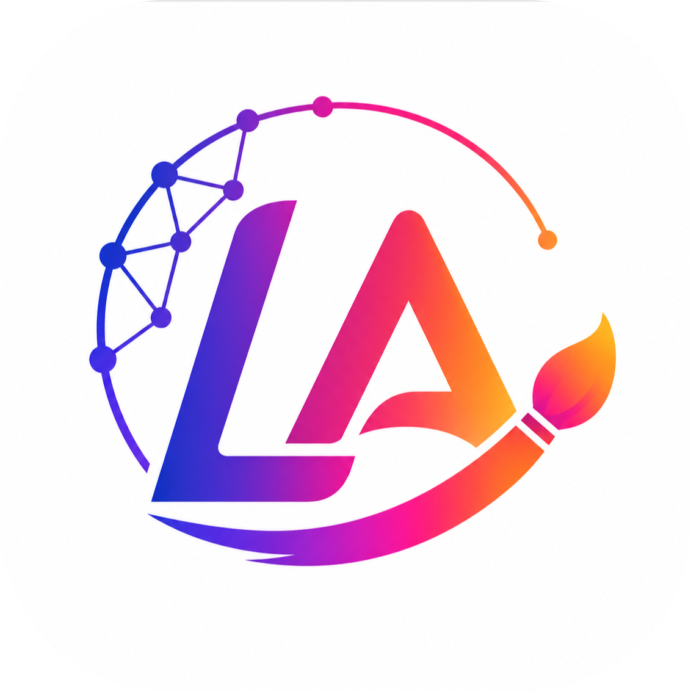
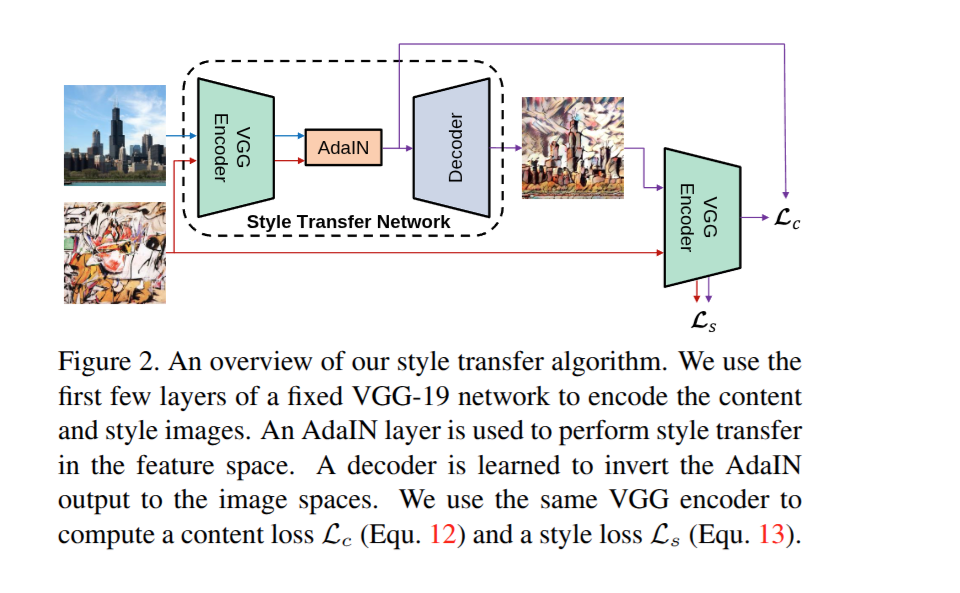
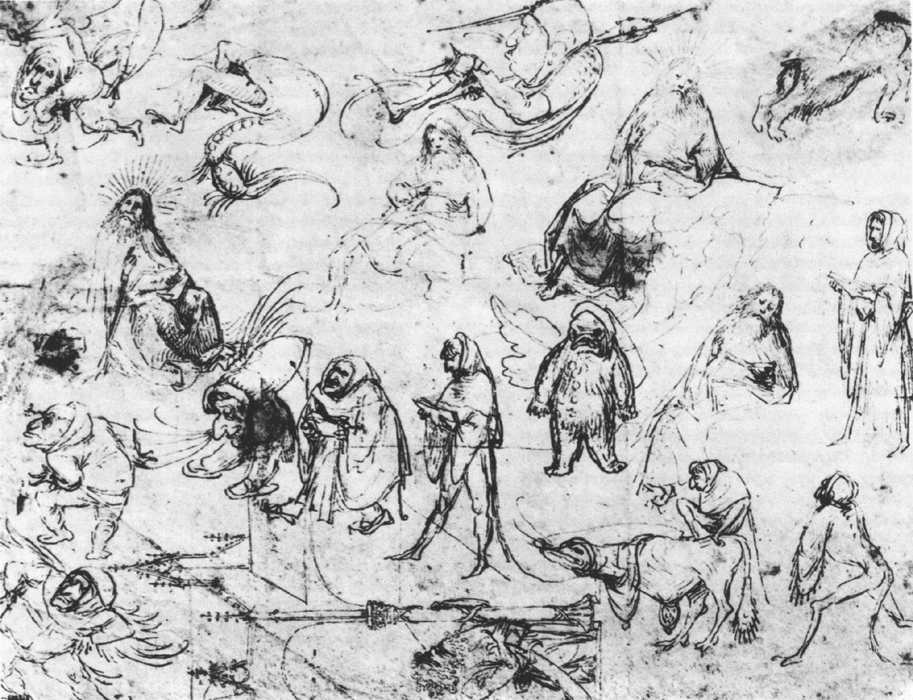
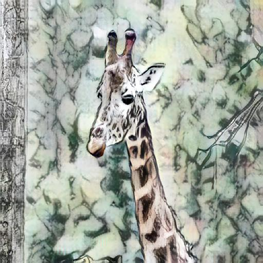
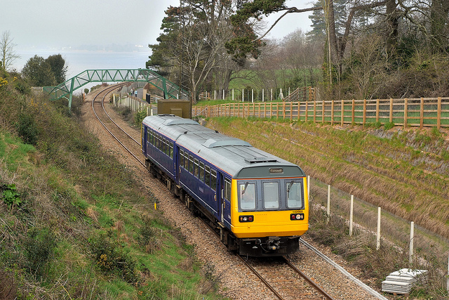
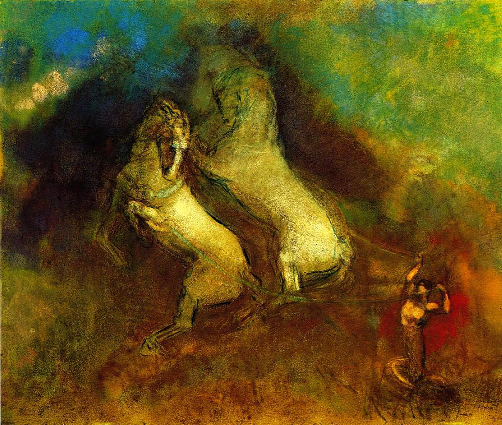
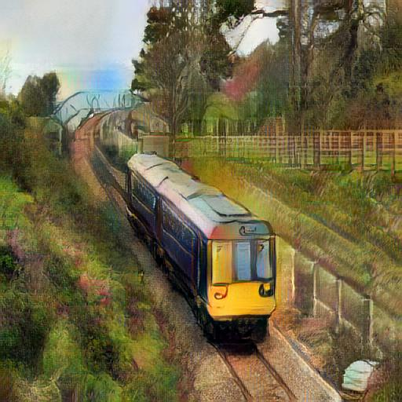

# 🎨 LakshArt AI – Neural Style Transfer using AdaIN

<p align="center">

</p>

<p align="center">
Transform ordinary images into artistic creations using Deep Learning and Adaptive Instance Normalization (AdaIN).
</p>

<p align="center">


</p>

---

# 🌐 Live Demo

🚀 Live Application: [https://lakshaybamel-lakshart-ai.hf.space](https://lakshaybamel-lakshart-ai.hf.space)

---


# 📖 Overview

LakshArt AI is an AI-powered Neural Style Transfer web application that combines:

* content from one image
* artistic style from another image

to generate AI-created artwork.

The project uses Adaptive Instance Normalization (AdaIN) with a VGG-based encoder-decoder architecture to perform arbitrary style transfer in real time.

Users can upload:

* content image
* style image

and instantly generate stylized outputs through a Flask web interface.

---

# ✨ Features

✅ Upload content images  
✅ Upload style images  
✅ Real-time style transfer  
✅ Deep Learning powered image generation  
✅ AdaIN architecture  
✅ Example image gallery  
✅ Interactive Flask UI  
✅ Dockerized deployment  
✅ Hugging Face Spaces hosting  

---

# 🧠 How LakshArt AI Works

### Step 1 — Content Encoding

Extract semantic features using pretrained VGG encoder.

---

### Step 2 — Style Encoding

Extract style statistics.

---

### Step 3 — AdaIN Transformation

Adaptive Instance Normalization aligns:

* mean
* variance

between content and style features.

---

### Step 4 — Decoder

Generate stylized output image.

---

# 🏗 Architecture

<p align="center">

</p>

---

# 🖼 Result Gallery

| Content                                                      | Style                                                      | Output                                                      |
| ------------------------------------------------------------ | ---------------------------------------------------------- | ----------------------------------------------------------- |
|  |  |  |
|  |  |  |

---

# 🧠 Model Details

LakshArt AI uses Encoder → AdaIN → Decoder architecture.

| Component      | Description                     |
| -------------- | ------------------------------- |
| Encoder        | Pretrained VGG-19               |
| Style Transfer | Adaptive Instance Normalization |
| Decoder        | Custom trained decoder          |
| Framework      | PyTorch                         |
| Inference      | Real-time generation            |

Model files:

* vgg_normalised.pth
* decoder_final.pth

Pipeline:

Content → Encoder → AdaIN → Decoder → Stylized Output

---

# 📊 Dataset Information

### Content Dataset

COCO Dataset 2017

Used for:

* scene understanding
* object representation
* semantic feature learning

---

### Style Dataset

Painter by Numbers

Used for:

* artistic style extraction
* color distribution learning
* texture learning

Contains artworks from multiple artists and styles.

---

# 🛠 Tech Stack

### Deep Learning

* PyTorch
* TorchVision
* VGG-19
* AdaIN

### Backend

* Flask
* Flask-WTF
* WTForms

### Frontend

* HTML
* CSS
* Jinja2 Templates

### Deployment

* Hugging Face Spaces
* Docker
* Git LFS

---

# 📁 Project Structure

```bash
LakshArt-AI/
├─ app.py
├─ train.py
├─ requirements.txt
├─ vgg_normalised.pth
├─ experiments/
│  └─ final_exp/
│     └─ decoder_final.pth
├─ sample-dataset/
│  ├─ content-data/
│  └─ style-data/
├─ static/
│  ├─ assets/
│  │  ├─ architecture.png
│  │  ├─ logo.png
│  │  └─ examples/
│  ├─ css/
│  │  └─ style.css
│  └─ uploads/
│     ├─ content/
│     ├─ style/
│     └─ outputs/
├─ templates/
│  └─ index.html
└─ utils/
   ├─ models.py
   └─ utils.py
```

# ⚙ Installation

Clone repository:

```bash
git clone https://github.com/lakshaybamel/LakshArt-AI.git
```

Move into project:

```bash
cd LakshArt-AI
```

Create virtual environment:

```bash
python -m venv venv
```

Activate:

Windows:

```bash
venv\Scripts\activate
```

Install requirements:

```bash
pip install -r requirements.txt
```

Run:

```bash
python app.py
```

Open:

```bash
http://localhost:5000
```

---

# 🚀 Deployment

LakshArt AI is deployed on Hugging Face Spaces using Docker.

Important:

This GitHub repository is the main project repository only.

Deployment for Hugging Face was performed using a separate local deployment folder containing:

* Docker setup
* deployment configurations
* Hugging Face-specific files

Those deployment files are intentionally excluded from this repository.

Deployment journey involved:

* Git LFS integration
* Docker configuration
* binary asset handling
* runtime debugging
* Hugging Face setup

Live App:

https://lakshaybamel-lakshart-ai.hf.space

---
# 📈 Training Details

| Parameter         | Value     |
| ----------------- | --------- |
| Epochs            | 200       |
| Batch Size        | 16        |
| Learning Rate     | 0.0001    |
| Content Weight    | 1.0       |
| Style Weight      | 10        |
| Content Size      | 512 × 512 |
| Style Size        | 512 × 512 |
| Final Output Size | 256 × 256 |
| Framework         | PyTorch   |
| Method            | AdaIN     |

**Content Dataset:** COCO Dataset 2017  `
**Style Dataset:** Painter by Numbers


---

# 🎯 Future Improvements

* Style intensity slider
* Faster inference optimization
* Authentication
* User history
* Cloud integration
* More artistic presets

---

# 👨‍💻 Author

Lakshay Bamel

MCA Student — BIT Mesra

⭐ Star the repository if you found this project interesting.
